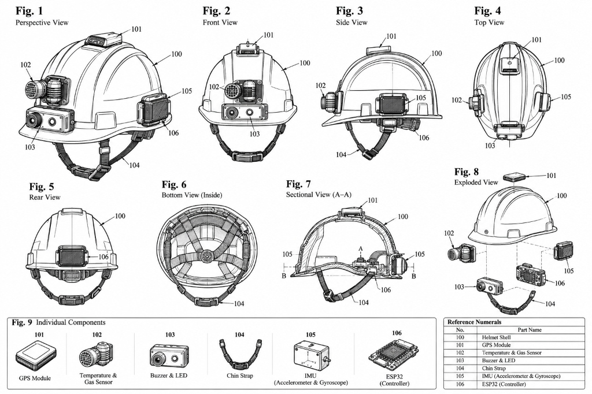

# PATENT APPLICATION DRAFT

---

### 1. Full Name, Nationality and Address of Applicant(s):

| Full Name | Nationality | Address |
| :--- | :--- | :--- |
| **Vishwakarma Institute of Technology** | Indian | 666, Upper Indiranagar, Bibwewadi, Pune, Maharashtra, India – 411 037 |
| **Vishwakarma University** | Indian | Survey No 2, 3, 4, Kondhwa Main Rd, Laxmi Nagar, Betal Nagar, Kondhwa, Pune, Maharashtra, India - 411048 |

---

### 2. Full Name (including middle name), Nationality, Address, Mail ID, and Phone Number of Inventor(s):

| Full Name (Including middle name) | Nationality | VIT Address (Start with full dept. name followed by full institute name) | Mail ID | Phone No. |
| :--- | :--- | :--- | :--- | :--- |
| **Prof. Vijaykumar Raghunath Ghule** | Indian | Department of Computer Science & Engineering (Data Science), Vishwakarma Institute of Technology, Pune, Maharashtra, India – 411 037 | Vijaykumar.ghule@vit.edu | +91 8624046893 |
| **Sail Sitaram Nagale** | Indian | Department of Computer Science & Engineering (Data Science), Vishwakarma Institute of Technology, Pune, Maharashtra, India – 411 037 | sail.nagale@vit.edu | +91 [Contact Number] |

---

### Copy and paste clear soft copy of signatures of all inventors in the following table:

| Prof. Vijaykumar Raghunath Ghule | Sail Sitaram Nagale | [Inventor Name 3] | [Inventor Name 4] |
| :---: | :---: | :---: | :---: |
| *(Signature)* | *(Signature)* | *(Signature)* | *(Signature)* |
| **[Inventor Name 5]** | **[Inventor Name 6]** | **[Inventor Name 7]** | **[Inventor Name 8]** |
| *(Signature)* | *(Signature)* | *(Signature)* | *(Signature)* |

---

### 3. Title of the Invention:
**IOT AND MACHINE LEARNING-BASED PREDICTIVE WORKER SAFETY HELMET WITH REAL-TIME HAZARD DETECTION**

*(Word Count: 14 words - Complies with limit of not more than 15 words)*

---

### 4. Technical Field of the Invention:
The present invention relates generally to industrial occupational safety systems, wearable embedded electronic devices, and edge computing. More specifically, the present invention relates to an Internet of Things (IoT) and Machine Learning (ML) enabled predictive smart helmet capable of multi-modal environmental hazard detection, worker physiological biometric monitoring, 6-axis kinematic fall and impact detection, on-device predictive risk scoring, and dual-mode resilient wireless telemetry dispatch for construction, mining, and hazardous industrial sites.

---

### 5. Prior Art:
Conventional safety headgear used in industrial, construction, and mining facilities consists predominantly of passive thermoplastic or fiberglass shells engineered solely to cushion mechanical impact from falling debris. However, these traditional helmets cannot sense invisible hazards such as dangerous ambient toxic gases, prolonged extreme thermal exposure, or acute physiological distress in workers.

Recent electronic safety helmets integrate single-variable sensors but suffer from critical drawbacks:
1. **Static Thresholding & High False Alarms:** Existing devices trigger alarms based on rigid, point-in-time threshold breaches, failing to detect gradual pre-incident hazard buildup or generating nuisance alarms.
2. **Lack of Predictive Multi-Sensor Fusion:** Conventional systems do not correlate physiological metrics (heart rate) with ambient parameters (temperature, toxic gases) and kinematic vectors (acceleration magnitude, jerk).
3. **Cloud Dependency & Network Latency:** Existing solutions rely on constant cloud connectivity for computational inference, rendering them ineffective in radio-shadowed environments like tunnels or deep basements.
4. **Absence of Integrated Geo-Telemetry:** Inability to pinpoint exact coordinates of incapacitated workers during emergencies delays rescue intervention.

The present invention overcomes all of the above disadvantages by executing on-device edge ML inference, dynamic feature extraction, predictive risk scoring (0-100), dual-action local/remote alarming, and hybrid LoRa/Wi-Fi telemetry with GPS tracking.

---

### 6. Objective(s) of Invention:
The primary objectives of the present invention are:
1. To provide a non-intrusive smart safety helmet that continuously monitors environmental hazards, worker biometrics, and kinematic motion in real time.
2. To provide an edge computing architecture with an embedded machine learning model capable of computing a dynamic continuous Safety Risk Score (0–100) and classifying conditions into Low, Medium, and High Risk tiers.
3. To reliably detect emergencies including sudden falls, high-g mechanical impacts, hazardous gas accumulation, elevated heat stress, and abnormal heart rates before fatal incidents occur.
4. To implement a dual-mode low-latency emergency response mechanism comprising instant localized audiovisual alarms (<100 ms) and automated wireless telemetry dispatch to a supervisory dashboard.
5. To incorporate geospatial coordinates via an onboard GPS receiver to enable immediate search-and-rescue localization across large-scale industrial infrastructures.
6. To log multi-modal time-series safety records to a central database for retrospective incident analysis, compliance audits, and proactive workplace hazard mitigation.

---

### 7. Synopsis:
The present invention is an IoT and Machine Learning-enabled Predictive Worker Safety Helmet. The device comprises an industrial protective helmet shell **(100)** embedding a Global Positioning System (GPS) module **(101)** mounted at the top crown, a dual temperature and hazardous gas sensor unit **(102)** positioned on the forward lateral housing, an audiovisual warning unit **(103)** (piezoelectric buzzer and high-intensity LED) positioned on the front visor brim, an ergonomic chin strap **(104)** with an embedded photoplethysmography (PPG) pulse sensor for continuous pulse rate acquisition, a 6-axis Inertial Measurement Unit **(105)** (IMU containing 3-axis accelerometer and 3-axis gyroscope) mounted on the lateral shell, and a central microcontroller and edge processing unit **(106)** (ESP32 SoC with Wi-Fi/LoRa transceiver and power management circuitry) housed in a protected rear/lateral enclosure.

The microcontroller samples multi-sensor feeds, applies edge noise filtering, and extracts dynamic statistical features (acceleration magnitude, jerk derivative, rate of temperature change, and gas concentration). A trained machine learning model running on the edge processor computes a real-time Risk Score (0–100). When the score exceeds predefined safety bounds or a critical fall/impact signature is recognized, the helmet immediately actuates local audiovisual warnings **(103)** and dispatches an emergency telemetry packet containing worker ID, physiological vitals, and GPS coordinates **(101)** to a central supervisory dashboard.

---

### 8. Brief Description of Drawings:

The invention is illustrated in the accompanying technical drawings (**Figures 1 to 9**), wherein common single numerals are used to designate specific structural and electronic components across all views:

- **Figure 1** illustrates a Perspective View of the assembled predictive worker safety helmet.
- **Figure 2** illustrates a Front View of the predictive worker safety helmet.
- **Figure 3** illustrates a Side View of the predictive worker safety helmet.
- **Figure 4** illustrates a Top View showing crown component placement.
- **Figure 5** illustrates a Rear View showing the main controller enclosure.
- **Figure 6** illustrates a Bottom View (Inside) displaying internal harness and strap arrangement.
- **Figure 7** illustrates a Sectional View (taken along section line A–A).
- **Figure 8** illustrates an Exploded View depicting the mechanical and electronic modular assembly.
- **Figure 9** illustrates Individual Component Views of constituent sub-assemblies.

#### Reference Numerals Denoting Components in Drawings:
| No. | Part / Subsystem Name | Functional Description |
| :---: | :--- | :--- |
| **100** | **Helmet Shell** | High-impact protective thermoplastic outer shell |
| **101** | **GPS Module** | Top crown-mounted geospatial positioning receiver |
| **102** | **Temperature & Gas Sensor** | Multi-modal ambient thermal and toxic gas ($CO, CH_4, H_2S, LPG$) detector |
| **103** | **Buzzer & LED** | Front brim-mounted acoustic alarm and high-intensity optical alert unit |
| **104** | **Chin Strap** | Ergonomic harness with integrated biometric photoplethysmography pulse sensor |
| **105** | **IMU (Accelerometer & Gyroscope)** | Lateral shell-mounted 6-axis kinematic inertial measurement unit |
| **106** | **ESP32 Controller** | Main edge processor, power regulation, and hybrid Wi-Fi/LoRa wireless transceiver |

---

### 9. Detailed Description of the Invention:

Referring to **Figures 1 through 9**, the predictive worker safety helmet comprises an industrial high-impact thermoplastic outer shell **(100)** engineered to provide structural head protection. A GPS module **(101)** is rigidly affixed to the top crown apex to maintain an unobstructed line-of-sight satellite reception for real-time spatial positioning.

Mounted on the front lateral perimeter is a combined environmental sensor suite **(102)** comprising a digital temperature sensor and a toxic gas sensor configured to measure ambient heat and dangerous concentrations of $CO$, $CH_4$, $H_2S$, and $LPG$. On the front brim/visor, an audiovisual warning unit **(103)** is integrated, comprising an acoustic piezoelectric buzzer and a high-luminescence flashing alert LED for immediate wearer warning.

Secured to the helmet shell is an adjustable chin strap **(104)** having an integrated biometric photoplethysmography (PPG) pulse sensor arranged to maintain continuous contact with the wearer's skin at the jaw/neck to measure cardiovascular pulse rate. A 6-axis Inertial Measurement Unit **(105)** (IMU combining a 3-axis accelerometer and a 3-axis gyroscope) is mounted on the lateral shell to continuously track kinematic motion, tilt angles, free-fall dynamics, and impact vectors.

The main processing and communication hub is an ESP32 microcontroller unit **(106)** mounted within a sealed, impact-resistant rear housing. The controller integrates a dual-core 32-bit CPU, power regulation circuitry, rechargeable lithium battery, and a hybrid Wi-Fi / LoRa wireless transceiver.

#### Operational Pipeline & Machine Learning Edge Workflow:
1. **Real-Time Multi-Sensor Acquisition:** The IMU **(105)** is sampled at 50 Hz, biometric sensor on chin strap **(104)** at 20 Hz, and temperature/gas sensors **(102)** at 1 Hz.
2. **Dynamic Edge Preprocessing & Feature Extraction:** The controller **(106)** calculates total acceleration magnitude $A_{mag}(t) = \sqrt{a_x^2 + a_y^2 + a_z^2}$, dynamic jerk derivative $J(t) = \frac{dA_{mag}}{dt}$, moving average heart rate, temperature rate-of-change, and toxic gas slope.
3. **Predictive Risk Scoring ($0–100$):** An onboard pre-trained machine learning model processes the feature vector to generate a continuous Safety Risk Score ($R$). The classification logic is partitioned into:
   - **Low Risk ($0 \le R < 40$):** Normal operating state. Sensor logs transmitted periodically.
   - **Medium Risk ($40 \le R < 75$):** Advisory state (e.g. rising heat or moderate gas). Intermittent warning signaled via LED **(103)**.
   - **High Risk ($75 \le R \le 100$):** Critical emergency (e.g. fall trajectory characterized by high jerk $J > 25\text{ g/s}$ followed by immobility, acute gas leak $> 50\text{ PPM}$). Continuous local alarm triggered.
4. **Dual-Action Alert & Telemetry Dispatch:** The controller triggers continuous audible alarm via buzzer/LED **(103)** and broadcasts an emergency packet containing worker ID, telemetry, and GPS coordinates **(101)** over LoRa/Wi-Fi to the supervisory command center.

---

### 10. Best Method of Performance of the Invention:
In practical deployment, an industrial worker fastens the helmet shell **(100)** securely using chin strap **(104)** and powers on the controller unit **(106)**. The controller executes an automatic power-on self-test diagnostic on all sensors **(101, 102, 104, 105)**, emits a confirmation beep via buzzer **(103)**, and establishes a wireless handshake with the local gateway.

During work, the IMU **(105)** continuously monitors head dynamics at 50 Hz. If the worker slips from scaffolding, the IMU records free-fall weightlessness followed by an impact shock ($>3.5g$) and a motionless window. Simultaneously, if toxic gas levels exceed safety thresholds or thermal stress causes heart rate escalation ($>130\text{ bpm}$), the edge ML model computes a compound risk score of $R \ge 85$ (High Risk). Within 80 milliseconds, the buzzer and LED **(103)** fire at 90 dB, and an emergency LoRa packet containing latitude and longitude from the GPS module **(101)** is broadcast to the supervisory command dashboard, enabling rescue teams to pinpoint and extract the worker within minutes.

---

### 11. CLAIMS:

**We Claim:**

1. An IoT and machine learning-enabled predictive worker safety helmet system comprising:
   - a protective helmet shell **(100)** configured to be worn by an industrial worker;
   - a geospatial positioning unit comprising a global positioning system (GPS) module **(101)** mounted to said helmet shell;
   - an environmental sensing unit including a temperature and hazardous gas sensor module **(102)** mounted to said helmet shell;
   - an audiovisual warning unit **(103)** comprising an acoustic buzzer and a visual light emitting diode (LED) positioned on said helmet shell;
   - a chin strap **(104)** having an integrated biometric photoplethysmography (PPG) pulse sensor positioned to maintain skin contact;
   - a kinematic sensing unit comprising a 6-axis inertial measurement unit (IMU) **(105)** including a 3-axis accelerometer and a 3-axis gyroscope; and
   - a microcontroller and edge processing unit **(106)** communicatively coupled to said sensors, warning unit, and an integrated wireless transceiver, wherein said edge processing unit is configured to extract multi-modal feature vectors from real-time sensor data, compute a predictive safety risk score ($0$ to $100$) using an embedded machine learning model, categorize said score into a plurality of risk tiers, and autonomously actuate said audiovisual warning unit **(103)** and transmit emergency telemetry packets to a supervisory dashboard upon detection of a hazardous condition.

2. The system as claimed in claim 1, wherein said machine learning model is trained on historical multi-modal industrial sensor data and evaluates an input feature vector comprising instantaneous acceleration magnitude, dynamic jerk derivative, moving average heart rate, rate of temperature increase, and toxic gas concentration to predict potential safety incidents before threshold failure.

3. The system as claimed in claim 1, wherein said edge processing unit **(106)** is configured with a tri-level risk classification logic comprising a Low Risk level ($0 \le R < 40$) signifying normal operational parameters, a Medium Risk level ($40 \le R < 75$) triggering an advisory alert on said supervisory dashboard and intermittent local warning, and a High Risk level ($75 \le R \le 100$) triggering continuous local acoustic and visual alarms and instantaneous transmission of emergency geospatial and physiological payloads.

4. The system as claimed in claim 1, wherein said kinematic sensing unit **(105)** executes a fall and collision detection routine configured to identify a free-fall acceleration signature followed by a high-g impact peak exceeding a defined acceleration threshold and a subsequent zero-motion window.

5. The system as claimed in claim 1, wherein said hazardous gas sensor **(102)** is configured to detect one or more toxic and flammable gases selected from the group consisting of Carbon Monoxide (CO), Methane ($CH_4$), Hydrogen Sulfide ($H_2S$), and Liquefied Petroleum Gas (LPG).

6. The system as claimed in claim 1, wherein said wireless transceiver of controller **(106)** is configured with automated failover logic to transmit emergency packets over LoRa frequencies when local Wi-Fi network connectivity is unavailable.

7. The system as claimed in claim 1, wherein said emergency telemetry packet transmitted to said supervisory dashboard comprises worker identification code, real-time GPS coordinates from module **(101)**, time stamp, current heart rate from strap sensor **(104)**, ambient gas concentration and temperature from module **(102)**, and current predictive risk score.

8. A computer-implemented method for predictive occupational safety monitoring using a smart helmet, comprising the steps of:
   - acquiring continuous time-synchronized data streams from a multi-sensor array comprising temperature and gas sensor **(102)**, biometric sensor **(104)**, 6-axis IMU **(105)**, and GPS module **(101)**;
   - filtering raw sensor data to eliminate high-frequency noise and motion artifacts;
   - extracting dynamic temporal and kinematic features from the filtered sensor data;
   - executing an embedded machine learning predictive risk assessment algorithm on the extracted features to generate a normalized numerical risk score from $0$ to $100$;
   - comparing said risk score against defined safety classification thresholds;
   - energizing a local audiovisual alert unit **(103)** on the helmet when the risk score exceeds a predetermined threshold; and
   - transmitting an emergency telemetry packet containing geospatial location from GPS **(101)** and physiological metrics over a wireless interface to a remote monitoring dashboard for emergency response coordination.

---

### 12. Inventive Step of Your Invention:
The inventive step of the present invention resides in the technical convergence of:
1. **Multi-Modal Predictive Sensor Fusion vs. Static Thresholding:** Instead of relying on isolated point-in-time threshold triggers, the invention dynamically correlates multi-channel physiological, environmental, and kinematic variables through an edge-optimized ML model, detecting evolving pre-incident hazards before worker incapacitation.
2. **On-Device Edge Processing & Sub-Second Latency:** Embedding the feature extraction and classification model directly on the microcontroller **(106)** guarantees instantaneous local warning actuation without relying on cloud availability or suffering network delays.
3. **Resilient Dual-Mode Wireless Telemetry & Integrated GPS:** Combining Wi-Fi with sub-GHz LoRa modulation ensures reliable emergency data transmission across deep construction trenches, tunnels, and remote industrial complexes alongside precise GPS coordinates from module **(101)**.

---

### 13. Industrial Application:
The present invention has direct industrial utility across multiple hazardous sectors:
- **Civil Construction and Infrastructure:** Real-time detection of falls from scaffolds, crane zone collisions, and heat exhaustion.
- **Mining and Tunneling:** Continuous monitoring of toxic and explosive gas buildup ($CO$, $CH_4$, $H_2S$), asphyxiation risks, and worker entrapment.
- **Petrochemical Refineries & Chemical Plants:** Early warning for volatile chemical leaks, excessive thermal proximity, and worker distress.
- **Heavy Manufacturing, Foundries & Metallurgy:** Heat stress indexing and impact monitoring in high-temperature blast furnace zones.
- **Firefighting and Disaster Rescue:** Real-time physiological tracking and geospatial tracing of emergency personnel in obscured environments.

---

### 14. Abstract:
An IoT and machine learning-enabled predictive worker safety helmet and method are disclosed for real-time hazard detection and proactive occupational safety monitoring. The smart helmet comprises an industrial helmet shell **(100)** integrating a top-mounted GPS module **(101)**, a temperature and hazardous gas sensor **(102)**, a front-mounted audiovisual alarm **(103)**, a chin strap with integrated biometric pulse sensor **(104)**, a lateral 6-axis IMU **(105)**, and an ESP32 edge microcontroller **(106)** with dual-mode wireless communication. The edge microcontroller continuously samples multi-modal sensor feeds, removes artifacts, extracts dynamic features, and executes an onboard machine learning model to compute a real-time risk score ($0–100$) categorized into low, medium, and high risk levels. Upon detecting hazardous events—such as falls, toxic gas leaks, excessive thermal stress, or cardiac irregularities—the helmet instantly actuates local alarms **(103)** and dispatches emergency telemetry packets containing exact GPS coordinates **(101)** to a central supervisory dashboard for rapid rescue intervention.

---

### 15. Drawing:

*Technical patent drawings containing Figs. 1 to 9 with standard single-numeral callouts (100–106):*

**Sheet 1/1: Figures 1 to 9 (Perspective, Orthographic, Sectional, Exploded, and Component Views with Reference Numerals)**
